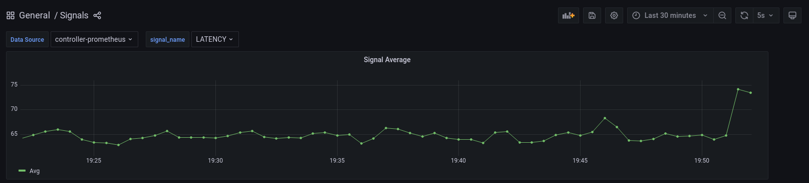
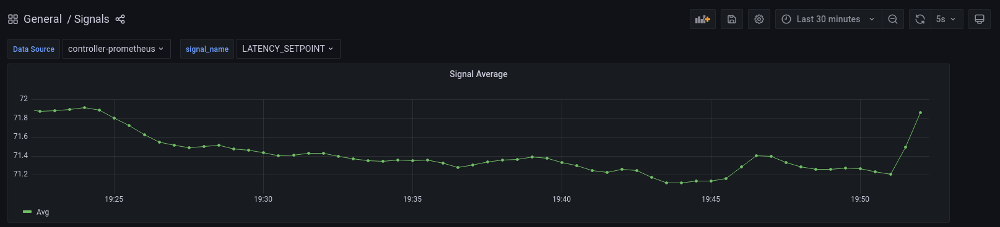
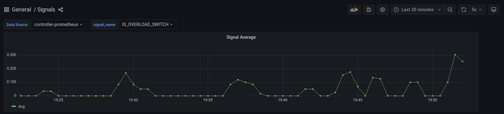

```mdx-code-block
import Tabs from '@theme/Tabs';
import TabItem from '@theme/TabItem';
import Zoom from 'react-medium-image-zoom';
```

## Policy Overview

Monitoring the health of a service is a critical aspect of ensuring reliable
operations. In this example, we will demonstrate how to detect an overload state
of a service and send an alert using Aperture's declarative policy language. The
policy will create a circuit that models the normal latency behavior of the
service using an exponential moving average (EMA). This enables the alerting
policy to automatically learn the normal latency threshold of each service,
reducing the need for manual tuning of alert policies for individual services.

One of the most reliable metrics to detect overload state is latency of the
service requests. In Aperture, latency of service requests can be reported using
a [_Flux Meter_](/concepts/flow-control/resources/flux-meter.md).

:::tip

To prevent the mixing of latency measurements across different workloads, it's
recommended to apply the Flux Meter to a single type of workload. For instance,
if a service has both Select and Insert API calls, it is advised to measure the
latency of only one of these workloads using a Flux Meter. Refer to the
[_Selector_](/concepts/flow-control/selector.md) documentation for guidance on
applying the Flux Meter to a subset of API calls for a service.

:::

## Policy Configuration

In this example, the EMA of latency is computed using metrics reported by the
Flux Meter and obtained periodically through a
[PromQL](https://prometheus.io/docs/prometheus/latest/querying/basics/) query.
The EMA of latency is then multiplied by a tolerance factor to calculate the
setpoint latency, which serves as a threshold for detecting an overloaded state.
That is, if the real-time latency of the service exceeds this setpoint (which is
based on the long-term EMA), the service is considered to be overloaded at that
moment.

```mdx-code-block
<Tabs>
<TabItem value="YAML">
```

```yaml
{@include: ./assets/detecting-overload/detecting-overload.yaml}
```

```mdx-code-block
</TabItem>
<TabItem value="Jsonnet">
```

```jsonnet
{@include: ./assets/detecting-overload/detecting-overload.jsonnet}
```

```mdx-code-block
</TabItem>
</Tabs>
```

### Circuit Diagram

<Zoom>

```mermaid
{@include: ./assets/detecting-overload/detecting-overload.mmd}
```

</Zoom>

### Playground

When the above policy is loaded in Aperture's
[Playground](https://github.com/fluxninja/aperture/blob/main/playground/README.md),
the various signal metrics collected from the execution of the policy can be
visualized:

<Zoom>

 `LATENCY`: Signal gathered
from the periodic execution of PromQL query on _Flux Meter_ metrics.

</Zoom>

<Zoom>

 `LATENCY_EMA`:
Exponential Moving Average of `LATENCY` signal.

</Zoom>

<Zoom>


`LATENCY_SETPOINT`: Latency above which the service is considered to be
overloaded. This is calculated by multiplying the exponential moving average
with a tolerance factor (`LATENCY_EMA` \* `1.1`).

</Zoom>

<Zoom>


`IS_OVERLOAD_SWITCH` is a signal that decides whether the overload is currently
happening or not based on comparing `LATENCY` with `LATENCY_SETPOINT`. Its value
is `0` when there is no overload and `1` during overloads.

</Zoom>
