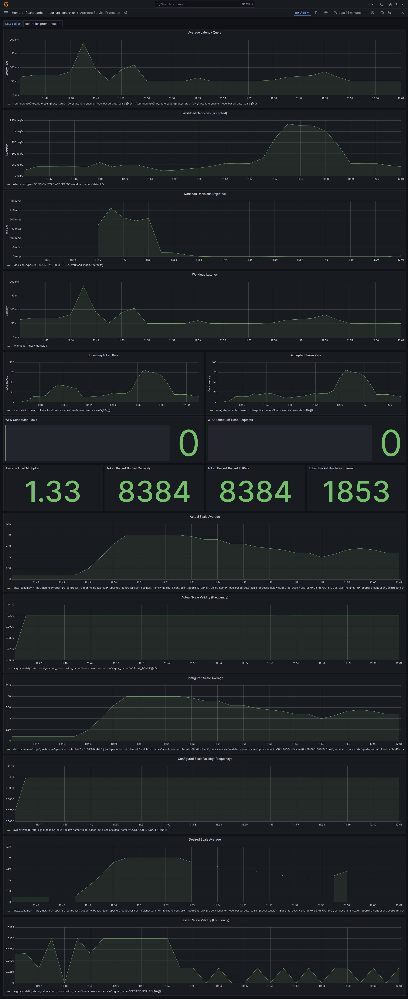

```mdx-code-block
import Tabs from '@theme/Tabs';
import TabItem from '@theme/TabItem';
import Zoom from 'react-medium-image-zoom';
```

:::note

The following policy is based on the
[Service Protection with Load-based Pod Auto-Scaler](/reference/blueprints/service-protection-with-load-based-pod-auto-scaler/average-latency.md)
blueprint.

:::

## Policy Overview

Responding to fluctuating service demand is a common challenge for maintaining
stable and responsive services. This policy, based on the Service Protection
with Load-based Pod Auto-Scaler
[blueprint](/reference/blueprints/service-protection-with-load-based-pod-auto-scaler/average-latency.md),
presents an evolved strategy to tackle the surges of service demands. It
introduces a mechanism to dynamically scale the service resources based on
observed load, thereby optimizing resource allocation and maintaining a balanced
system.

This policy employs two key strategies: it protects the service from sudden
traffic spikes, and it ensures the service scales proportionally to accommodate
sustained load changes. An
[_Auto Scaler_](/concepts/auto-scale/components/auto-scaler.md) component is
used to dynamically adjust the number of service instances in response to
changes in load and CPU utilization. This load-based auto-scaling is enacted by
a scale-out Controller that reads
[_Load Scheduler_](/concepts/flow-control/components/load-scheduler.md) signals,
effectively throttling traffic into a queue and scaling resources to match the
demand.

## Policy Configuration

This policy, ensures optimized performance at the selected
**`service1-demo-app.demoapp.svc.cluster.local`**, by applying a service
protection policy based on the average latency of the service. Based on the
latency, it performs auto-scaling of Kubernetes replicas for the selected
service, with a minimum of 1 and a maximum of 10 replicas.

To prevent frequent fluctuation, scale-in and scale-out cooldown periods of 40
and 30 seconds are defined. The **`dry_run`** parameter is set to false, meaning
the auto-scaling function is active.

```mdx-code-block
<Tabs>
<TabItem value="aperturectl values.yaml">
```

```yaml
{@include: ./assets/values.yaml}
```

```mdx-code-block
</TabItem>
</Tabs>
```

<details><summary>Generated Policy</summary>
<p>

```yaml
{@include: ./assets/policy.yaml}
```

</p>
</details>

:::info

[Circuit Diagram](./assets/graph.mmd.svg) for this policy.

:::

### Playground

When the above policy is loaded in Aperture's
[Playground](https://github.com/fluxninja/aperture/blob/main/playground/README.md),
it can be observed that as the response latency increases, the service
protection policy queues a proportion of requests. The _Auto Scaler_ makes a
scale-out decision as the `OBSERVED_LOAD_MULTIPLIER` becomes less than 1. As
replicas get added to the deployment, the `OBSERVED_LOAD_MULTIPLIER` increases
to more than 1, allowing the service to meet increased demand. The response
latency returns to a normal range, and the _Load Scheduler_ won't throttle any
traffic.

After the scale-out cooldown period, the scale-in based on CPU utilization gets
triggered, which will cause the replicas to decrease. Once the traffic ramps up
again, the above cycle continues.

<Zoom>



</Zoom>
