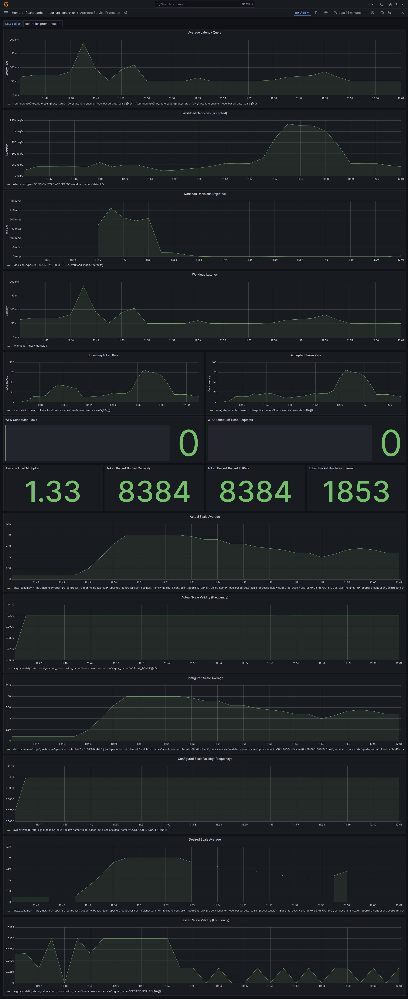

```mdx-code-block
import {apertureVersion} from '../../apertureVersion.js';
import CodeBlock from '@theme/CodeBlock';
import Tabs from '@theme/Tabs';
import TabItem from '@theme/TabItem';
import Zoom from 'react-medium-image-zoom';
```

## Overview

Responding to fluctuating service demand is a common challenge for maintaining
stable and responsive services. This policy introduces a mechanism to
dynamically scale service resources based on CPU usage, optimizing resource
allocation and ensuring that the service remains responsive even under high
load.

This policy employs auto-scaling strategy.

1. Auto-Scaling: An [_Auto Scaler_](/concepts/auto-scale.md#auto-scaler)
   component is used to dynamically adjust the number of service instances in
   response to changes in load. This load-based auto-scaling is enacted by a
   scale-out Controller that reads CPU usage of the service. The service
   replicas are scaled out when the CPU usage crosses the configured threshold
   value, effectively scaling resources to match the demand. During periods of
   low usage, the policy attempts to scale in when the CPU usage is back to
   normal defined value.

## Configuration

This policy is based on the
[Pod Auto Scaler](/reference/blueprints/auto-scaling/pod-auto-scaler.md)
blueprint. Auto-scaling is applied to the Deployment `search-service` with a
minimum of `1` and a maximum of `10` replicas.

The policy is configured to scale out when the CPU usage is above `50%` and
scale in when the CPU usage is below `30%`.

To prevent frequent fluctuation in replicas, scale-in cooldown period is set to
`40` seconds and scale-out cooldown periods are set to `30` seconds.

The below `values.yaml` file can be generated by following the steps in the
[Installation](#installation) section.

```mdx-code-block
<Tabs>
<TabItem value="aperturectl values.yaml">
```

```yaml
{@include: ./assets/cpu-usage-based-auto-scaling/values.yaml}
```

```mdx-code-block
</TabItem>
</Tabs>
```

<details><summary>Generated Policy</summary>
<p>

```yaml
{@include: ./assets/cpu-usage-based-auto-scaling/policy.yaml}
```

</p>
</details>

:::info

[Circuit Diagram](./assets/cpu-usage-based-auto-scaling/graph.mmd.svg) for this
policy.

:::

## Installation

Generate a values file specific to the policy. This can be achieved using the
command provided below.

```mdx-code-block
<CodeBlock language="bash">aperturectl blueprints values --name=auto-scaling/pod-auto-scaler --version={apertureVersion} --output-file=values.yaml</CodeBlock>
```

Adjust the values to match the application requirements. Use the following
command to generate the policy.

```mdx-code-block
<CodeBlock language="bash">aperturectl blueprints generate --name=auto-scaling/pod-auto-scaler
--values-file=values.yaml --output-dir=policy-gen --version={apertureVersion}</CodeBlock>
```

Apply the policy using the `aperturectl` CLI or `kubectl`.

```mdx-code-block
<Tabs>
<TabItem value="aperturectl" label="aperturectl">
```

Pass the `--kube` flag with `aperturectl` to directly apply the generated
policies on a Kubernetes cluster in the namespace where the Aperture Controller
is installed.

```mdx-code-block
<CodeBlock language="bash">aperturectl apply policy --file=policy-gen/configuration/cpu-usage-based-auto-scale.yaml --kube</CodeBlock>
```

```mdx-code-block
</TabItem>
<TabItem value="kubectl" label="kubectl">
```

Apply the policy YAML generated (Kubernetes Custom Resource) using the above
example with `kubectl`.

```bash
kubectl apply -f policy-gen/configuration/cpu-usage-based-auto-scale-cr.yaml -n aperture-controller
```

```mdx-code-block
</TabItem>
</Tabs>
```

### Policy in Action

During transient CPU usage spikes, it triggers the auto-scale policy, which
scales up the deployment. With the additional replicas in the deployment, the
service is now better equipped to handle the increased CPU usage as the requests
get distributed between the pods.

After the scale-out cooldown period, the scale-in function is triggered, which
reduces the number of replicas in response to reduced CPU usage.


