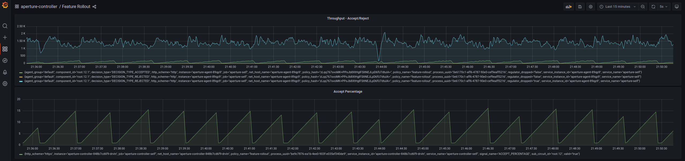

```mdx-code-block
import Tabs from '@theme/Tabs';
import TabItem from '@theme/TabItem';
import Zoom from 'react-medium-image-zoom';
```

:::note

The following policy is based on the
[Feature Rollout with Average Latency Feedback](/reference/blueprints/policies/feature-rollout/average-latency.md)
blueprint.

:::

## Policy Overview

Feature flags provide a mechanism for shipping new features to production
without compromising existing functionality. With Aperture, features can be
toggled on or off for specific user segments. The following policy enables you
to progressively introduce a new feature, all the while assessing its impact on
the application's latency. If the latency deteriorates beyond the configured
threshold, the rollout can be halted or reversed to ensure a seamless user
experience.

## Policy Configuration

In this example, the rollout of a new feature is driven by the **`criteria`** of
75ms latency threshold set for forward and reset actions. Any surge in average
latency beyond the 75ms mark in the
**`service1-demo-app.demoapp.svc.cluster.local`** would prompt a halt in the
rollout process.

The **`load_ramp`** section outlines the configuration details for the rollout
regulation. Specifically:

- **`service1-demo-app.demoapp.svc.cluster.local`** is selected as the targeted
  service for the rollout process.
- The rollout **`steps`** begin with 1% of the traffic being routed to the new
  feature and gradually increases to 100%, over a period of 300 seconds.

```mdx-code-block
<Tabs>
<TabItem value="aperturectl values.yaml">
```

```yaml
{@include: ./assets/with-average-latency-feedback/values.yaml}
```

```mdx-code-block
</TabItem>
</Tabs>

```

<details><summary>Generated Policy</summary>
<p>

```yaml
{@include: ./assets/with-average-latency-feedback/policy.yaml}
```

</p>
</details>

## Playground

The above policy can be loaded using the `feature_rollout` scenario in
[Playground](https://github.com/fluxninja/aperture/blob/main/playground/README.md)

:::info

[Circuit Diagram](./assets/with-average-latency-feedback/graph.mmd.svg) for this
policy.

:::

<Zoom>



</Zoom>
