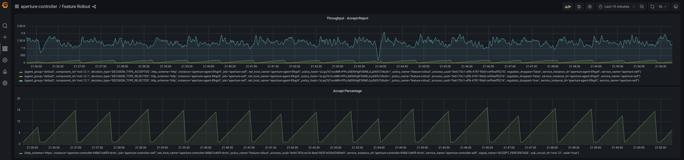

```mdx-code-block
import Tabs from '@theme/Tabs';
import TabItem from '@theme/TabItem';
import Zoom from 'react-medium-image-zoom';
```

:::note

The following policy is based on the
[Feature Rollout with Average Latency Feedback](/reference/blueprints/load-ramping/base.md)
blueprint.

:::

## Overview

API response time is a critical performance indicator and directly impacts user
experience. As new features are released, it's crucial to maintain service
latency within a defined threshold. This policy monitors the average latency of
an API, using it as a feedback mechanism for controlled feature rollout.

## Configuration

The service is instrumented with the Aperture SDK. A new feature,
`awesome-feature`, is encapsulated within a control point in the code.

The **`load_ramp`** section details the rollout procedure:

- **`awesome_feature`** is the target for the rollout process.
- The rollout begins with 1% of traffic directed to the new feature, gradually
  increasing to 100% over a period of 300 seconds.

The feature rollout is manually initiated by applying the dynamic configuration
for this policy, as specified in the dynamic-values tab below.

During the rollout, the average latency of the **`/checkout`** API on the
**`checkout.prod.svc.cluster.local`** service gets monitored. If the API
endpoint latency remains below 75ms, the awesome-feature rollout proceeds. If
the average latency surpasses 75ms, the policy automatically reverts the rollout
back to the initial 1% threshold.

```mdx-code-block
<Tabs>
<TabItem value="aperturectl values.yaml">
```

```yaml
{@include: ./assets/average-latency-feedback/values.yaml}
```

```mdx-code-block
</TabItem>
<TabItem value="aperturectl dynamic-values.yaml">
```

```yaml
{@include: ./assets/average-latency-feedback/dynamic-values.yaml}
```

```mdx-code-block
</TabItem>

</Tabs>

```

<details><summary>Generated Policy</summary>
<p>

```yaml
{@include: ./assets/average-latency-feedback/policy.yaml}
```

</p>
</details>

## Policy in Action

In this scenario, the new `awesome-feature` causes a performance regression in
the service, leading to increased response times. As the rollout percentage
increases, the latency threshold of 75ms is exceeded, prompting the policy to
automatically revert the rollout back to the initial 1% threshold. This action
results in the return of the latency to normal levels.

:::info

[Circuit Diagram](./assets/average-latency-feedback/graph.mmd.svg) for this
policy.

:::

<Zoom>



</Zoom>
