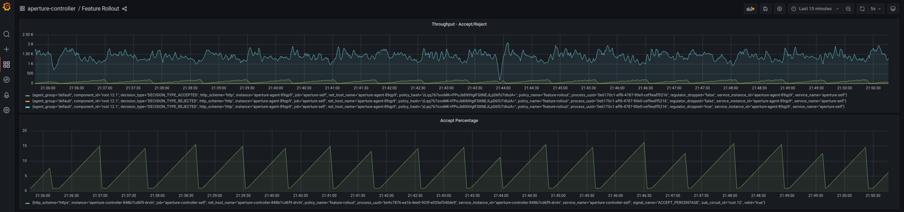

```mdx-code-block
import {apertureVersion} from '../../apertureVersion.js';
import CodeBlock from '@theme/CodeBlock';
import Tabs from '@theme/Tabs';
import TabItem from '@theme/TabItem';
import Zoom from 'react-medium-image-zoom';
```

## Overview

API response time is a critical performance indicator and directly impacts user
experience. As new features are released, it's crucial to maintain service
latency within a defined threshold. This policy monitors the average latency of
an API, using it as a feedback mechanism for controlled load ramp.

## Configuration

This policy is based on the
[Load Ramping with Average Latency Feedback](/reference/blueprints/load-ramping/base.md)
blueprint. The service is instrumented with the Aperture SDK. A new feature,
`awesome-feature`, is encapsulated within a control point in the code.

The **`load_ramp`** section details the ramping procedure:

- **`awesome_feature`** is the target for the ramping process.
- The ramping begins with 1% of traffic directed to the new feature, gradually
  increasing to 100% over a period of 300 seconds.

The load ramp is manually initiated by applying the dynamic configuration for
this policy, as specified in the dynamic-values tab below.

During the ramping, the average latency of the **`/checkout`** API on the
**`checkout.prod.svc.cluster.local`** service gets monitored. If the API
endpoint latency remains below 75ms, the awesome-feature ramp proceeds. If the
average latency surpasses 75ms, the policy automatically reverts the ramping
back to the initial 1% threshold.

The below `values.yaml` file can be generated by following the steps in the
[Installation](#installation) section.

```mdx-code-block
<Tabs>
<TabItem value="aperturectl values.yaml">
```

```yaml
{@include: ./assets/average-latency-feedback/values.yaml}
```

```mdx-code-block
</TabItem>
<TabItem value="aperturectl dynamic-values.yaml">
```

```yaml
{@include: ./assets/average-latency-feedback/dynamic-values.yaml}
```

```mdx-code-block
</TabItem>

</Tabs>

```

<details><summary>Generated Policy</summary>
<p>

```yaml
{@include: ./assets/average-latency-feedback/policy.yaml}
```

</p>
</details>

## Installation

Generate a values file specific to the policy. This can be achieved using the
command provided below.

```mdx-code-block
<CodeBlock language="bash">aperturectl blueprints values --name=load-ramping/base --version={apertureVersion} --output-file=values.yaml</CodeBlock>
```

Adjust the values to match the application requirements. Use the following
command to generate the policy.

```mdx-code-block
<CodeBlock language="bash">aperturectl blueprints generate --name=load-ramping/base
--values-file=values.yaml --output-dir=policy-gen --version={apertureVersion}</CodeBlock>
```

Apply the policy using the `aperturectl` CLI or `kubectl`.

```mdx-code-block
<Tabs>
<TabItem value="aperturectl" label="aperturectl">
```

Pass the `--kube` flag with `aperturectl` to directly apply the generated policy
on a Kubernetes cluster in the namespace where the Aperture Controller is
installed.

```mdx-code-block
<CodeBlock language="bash">aperturectl apply policy --file=policy-gen/policies/load-ramping.yaml --kube </CodeBlock>
```

```mdx-code-block
</TabItem>
<TabItem value="kubectl" label="kubectl">
```

Apply the policy YAML generated (Kubernetes Custom Resource) using the above
example with `kubectl`.

```bash
kubectl apply -f policy-gen/configuration/load-ramping-cr.yaml -n aperture-controller
```

```mdx-code-block
</TabItem>
</Tabs>
```

## Start Rollout

Percentage rollout is initiated with
[dynamic configuration](/concepts/advanced/dynamic-configuration.md) of the
policy. Dynamic values facilitate run-time modifications, without shutting down
the policy.

In the generated dynamic values file, set the `start` parameter as `true`. Use
the command below to generate the file.

```mdx-code-block
<CodeBlock language="bash">aperturectl blueprints dynamic-values --name=load-ramping/base --version={apertureVersion} --output-file=dynamic-values.yaml </CodeBlock>

```

Use the following command to apply the dynamic configuration with `aperturectl`
or `kubectl`.

````mdx-code-block
<Tabs>
<TabItem value="aperturectl" label="aperturectl">


```bash
aperturectl apply dynamic-config --policy=load-ramping --file=dynamic-values.yaml
````

```mdx-code-block
</TabItem>
<TabItem value="kubectl" label="kubectl">
```

```bash
kubectl apply -f dynamic-values.yaml -n aperture-controller
```

```mdx-code-block
</TabItem>
</Tabs>
```

## Policy in Action

In this scenario, the new `awesome-feature` causes a performance regression in
the service, leading to increased response times. As the ramping percentage
increases, the latency threshold of 75ms is exceeded, prompting the policy to
automatically revert the ramping back to the initial 1% threshold. This action
results in the return of the latency to normal levels.

:::info

[Circuit Diagram](./assets/average-latency-feedback/graph.mmd.svg) for this
policy.

:::


