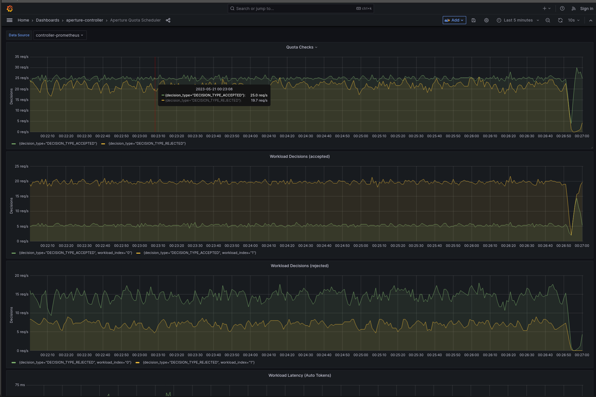

```mdx-code-block
import Tabs from '@theme/Tabs';
import TabItem from '@theme/TabItem';
import Zoom from 'react-medium-image-zoom';
```

:::note

The following policy is based on the
[Quota Scheduler](/reference/blueprints/quota-scheduler/base.md#policy-quota-scheduler)
blueprint.

:::

## Overview

When interacting with external APIs or services, adhering to the rate limits
imposed by the service provider is crucial. Aperture can model these external
API rate limits, enabling client-side implementation in a distributed
application. This approach not only prevents potential penalties for exceeding
the rate limits, but also allows Aperture to prioritize access to the external
API, ensuring essential workloads receive a fair share of the API quota.

## Configuration

This policy utilizes a quota scheduler to regulate the control point
**`some-external-api`**, which represents all outgoing requests made to an
external API from services within a distributed application. The rate limit is
applied per **`api_key`** label. The rate limiter interval is set to **`1`**
second, meaning that the token bucket is replenished with **`25`** tokens every
second, up to a maximum of **`500`** tokens. Lazy sync is enabled on the rate
limiter, which allows the rate limit counters on each Agent to sync four times
every interval (1 second).

The WFQ Scheduler prioritizes interactive and background requests with
respective priorities of **`200`** and **`50`**, ensuring that interactive calls
receive roughly four times the quota share of background requests.

```mdx-code-block
<Tabs>
<TabItem value="aperturectl values.yaml">
```

```yaml
{@include: ./assets/client-side-rate-limiting/values.yaml}
```

```mdx-code-block
</TabItem>
</Tabs>

```

<details><summary>Generated Policy</summary>
<p>

```yaml
{@include: ./assets/client-side-rate-limiting/policy.yaml}
```

</p>
</details>

## Policy in Action

The quota scheduler successfully ensures that the request rate remains within
the specified limits, as seen below, with a steady state of 25 requests per
second. Additionally, the workload decisions panel shows that interactive
requests receive approximately four times the acceptance rate compared to
background requests.

:::info

[Circuit Diagram](./assets/client-side-rate-limiting/graph.mmd.svg) for this
policy.

:::

<Zoom>



</Zoom>
