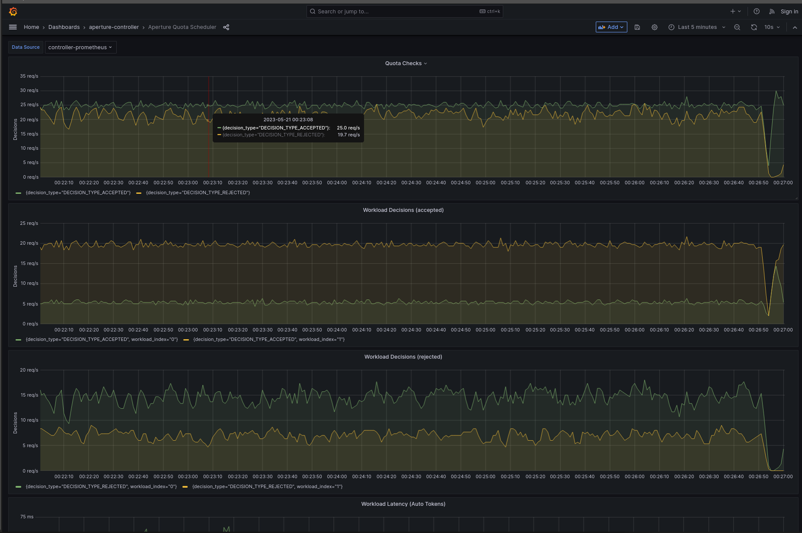

```mdx-code-block
import Tabs from '@theme/Tabs';
import TabItem from '@theme/TabItem';
import Zoom from 'react-medium-image-zoom';
```

:::note

The following policy is based on the
[Quota Scheduler](/reference/blueprints/policies/quota-scheduler.md#policy-quota-scheduler)
blueprint.

:::

## Policy Overview

The Quota Scheduler Policy is a sophisticated solution designed to manage and
limit outgoing requests from services to an external API server. This policy
makes applications cost-aware, ensuring that they operate within assigned quota
limits to prevent cost overruns. Workload priorities might differ based on the
application, and maintaining prioritized access for critical workloads during
external rate limiting is of paramount importance. The policy leverages the
[`Quota Scheduler`](/reference/blueprints/policies/quota-scheduler.md)
Blueprint, which brings together the token bucket rate limiting and a
[Weighted Fair Queuing (WFQ)](/concepts/flow-control/components/load-scheduler.md#scheduler)
based Workload Scheduler to balance quota limits and priority-based access
efficiently.

## Policy Configuration

In this policy, rate limiting is applied on
**`service1-demo-app.demoapp.svc.cluster.local`** based on the **`label_key`**
extracted from the request header. Consequently, user prioritization is achieved
through weights assigned to the **`user_type`** label value, also extracted from
the same request header. Finally, the WFQ Scheduler is set up to prioritize two
types of workloads: **`guest`**, with a priority of 50, **`subscriber`** with a
priority of 100.

```mdx-code-block
<Tabs>
<TabItem value="aperturectl values.yaml">
```

```yaml
{@include: ./assets/with-external-api-calls-prioritization/values.yaml}
```

```mdx-code-block
</TabItem>
</Tabs>

```

<details><summary>Generated Policy</summary>
<p>

```yaml
{@include: ./assets/with-external-api-calls-prioritization/policy.yaml}
```

</p>
</details>

## Playground

The above policy can be loaded using the `quota-scheduler` scenario in
[Playground](https://github.com/fluxninja/aperture/blob/main/playground/README.md)

:::info

[Circuit Diagram](./assets/with-external-api-calls-prioritization/graph.mmd.svg)
for this policy.

:::

<Zoom>



</Zoom>
