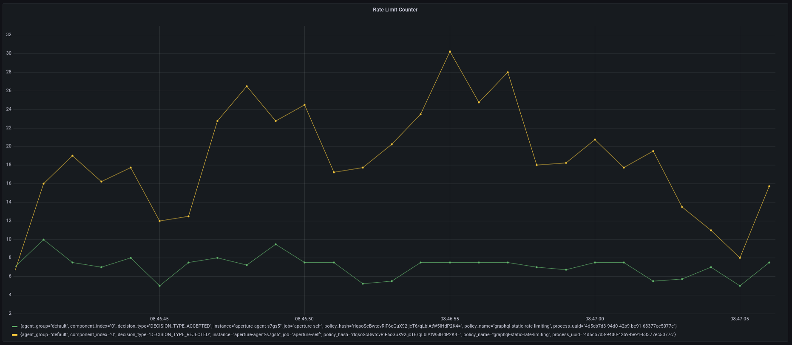

```mdx-code-block
import Tabs from '@theme/Tabs';
import TabItem from '@theme/TabItem';
import Zoom from 'react-medium-image-zoom';
```

## Policy Overview

This policy is an example of how to implement
[rate limiting](../../reference/blueprints/policies/rate-limiting.md) for
GraphQL queries using the [_Classifier_][rego-rules].

## Policy Configuration

The following policy contains [_Classifier_][classifier] that extracts the
**`userID`** claim from a JWT token in the request's authorization header and
then rate limit unique users based on the extracted **`user_id`** [_Flow
Label_][flow-label]; **`service1-demo-app.demoapp.svc.cluster.local** is
selected as the target service for this policy.

:::tip

Classification rules can be written based on
[HTTP requests](/concepts/flow-control/resources/classifier.md#live-previewing-requests)
and scheduler priorities can be defined based on
[Flow Labels](/concepts/flow-control/flow-label.md#live-previewing-flow-labels)
by live previewing them first using introspection APIs.

:::

```mdx-code-block
<Tabs>
<TabItem value="aperturectl values.yaml">
```

```yaml
{@include: ./assets/graphql-rate-limiting/values.yaml}
```

```mdx-code-block
</TabItem>
</Tabs>
```

<details><summary>Generated Policy</summary>
<p>

```yaml
{@include: ./assets/graphql-rate-limiting/graphql-rate-limiting-jwt.yaml}
```

</p>
</details>

:::info

[Circuit Diagram](./assets/graphql-rate-limiting/graphql-rate-limiting-jwt.mmd.svg)
for this policy.

:::

For example, if the mutation query is as follows

```graphql
mutation createTodo {
  createTodo(input: { text: "todo" }) {
    user {
      id
    }
    text
    done
  }
}
```

Without diving deep into how Rego works, the source section mentioned in this
tutorial does the following:

1. Parse the query
2. Check if the mutation query is `createTodo`
3. Verify the JWT token with a secret key `secret` (only for demonstration
   purposes)
4. Decode the JWT token and extract the `userID` from the claims
5. Assign the value of `userID` to the exported variable `userID` in Rego source

From there on, the Classifier rule assigns the value of the exported variable
`userID` in Rego source to `user_id` flow label, effectively creating a label
`user_id:1`. This label is used by the
[`RateLimiter`](/concepts/flow-control/components/rate-limiter.md) component in
the policy to limit the `createTodo` mutation query to `10 requests/second` for
each `userID`.

### Playground

In this example, the traffic generator is configured to generate
`50 requests/second` for 2-minutes. When loading the above policy in the
playground, you can observe that it accepts no more than `2 requests/second` at
any given time, and rejects the rest of the requests.

<Zoom>



</Zoom>

[rego-rules]: /concepts/flow-control/resources/classifier.md#rego
[flow-label]: /concepts/flow-control/flow-label.md
[classifier]: /concepts/flow-control/resources/classifier.md
