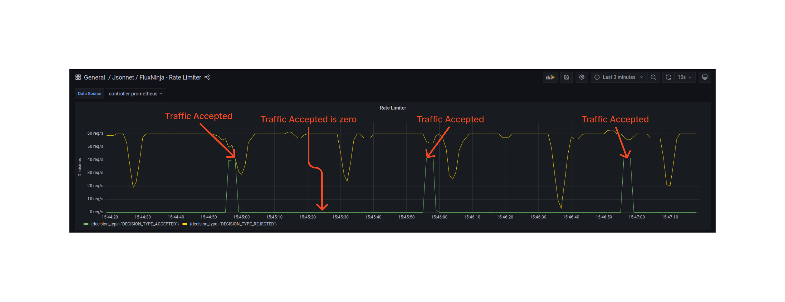

```mdx-code-block
import Tabs from '@theme/Tabs';
import TabItem from '@theme/TabItem';
import Zoom from 'react-medium-image-zoom';
```

## Overview

When exposing an API to the public, it is critical to protect it from potential
abuse by heavy hitters and malicious users. This ensures that the API remains
available and performs optimally for all users. Aperture's rate limiter
identifies users in the traffic using labels in the request. Distributed token
buckets are maintained for each user, ensuring that each user stays within the
assigned limits. The token bucket is configured with a fill rate that determines
the maximum request rate in steady state. The bucket's capacity determines the
magnitude of momentary surge allowed in request rates.

## Configuration

This example applies a rate limiter to the **`ingress`** control point on the
service **`catalog-service.prod.svc.cluster.local`**. Unique users are
identified based on the **`user_id`** header in the HTTP traffic. This header is
provided by the Envoy proxy and is available under the label key
**`http.request.header.user_id`** (see [Flow Labels](/concepts/flow-label.md)
for more information).

Each user is allowed **`2`** requests every **`1s`** (1 second) period. A burst
of up to **`40`** requests is allowed. This means that the user can send up to
**`40`** requests in the first second, and then **`2`** requests every second
after that. The bucket gets replenished at the rate of **`2`** requests per
second (the fill rate).

```mdx-code-block
<Tabs>
<TabItem value="aperturectl values.yaml">
```

```yaml
{@include: ./assets/static-rate-limiting/values.yaml}
```

```mdx-code-block
</TabItem>
</Tabs>

```

<details><summary>Generated Policy</summary>
<p>

```yaml
{@include: ./assets/static-rate-limiting/policy.yaml}
```

</p>
</details>

:::info

[Circuit Diagram](./assets/static-rate-limiting/graph.mmd.svg) for this policy.

:::

### Policy in Action

When the policy is applied at a service, no more than 2 requests per second
period (after an initial burst of 40 requests) are accepted for a user.

<Zoom>



</Zoom>
