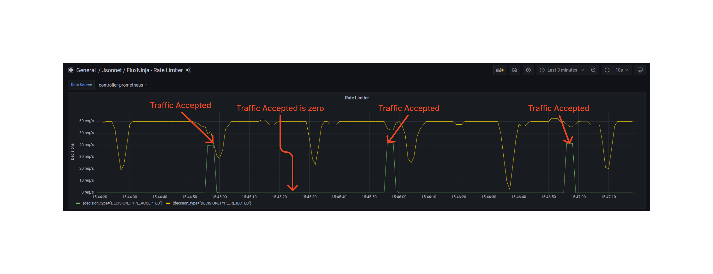

```mdx-code-block
import Tabs from '@theme/Tabs';
import TabItem from '@theme/TabItem';
import Zoom from 'react-medium-image-zoom';
```

## Policy Overview

Regulating incoming traffic in the face of overwhelming requests is vital to
maintaining the health and availability of a service. A powerful tool to achieve
this is the implementation of static rate limiting, aimed at controlling the
intensity of 'heavy-hitters.' This policy utilizes the
[Rate-Limiting Actuator](/concepts/flow-control/components/rate-limiter.md) to
curtail specific flow labels that go beyond their allocated quota within a
defined time frame (limit reset interval). It is an efficient and
straightforward mechanism for mitigating traffic congestion and preventing
potential service degradation or downtime.

## Policy Key Concepts

This policy is centered around the following fundamental components:

- [`selectors`](../../concepts/flow-control/selector.md) define the rules that
  decide how components should select flows for processing.
- [`control point`](../../concepts/flow-control/selector.md) can be considered
  as a critical checkpoint in code or data plane, a strategically placed spot
  where flow control decisions are applied. Developers define these points
  during the integration of API Gateways or Service Meshes or by using Aperture
  SDKs.
- [`rate_limiter`](../../concepts/flow-control/components/rate-limiter.md)
  prevents heavy traffic recurrence and its flexibility allows it to adapt to
  different labels, offering dynamic control over traffic flow.

## Policy Configuration

This example demonstrates rate limiting of unique users based on the `User-Id`
header in the HTTP traffic. Envoy proxy provides this header under the label key
`http.request.header.user_id` (see
[Flow Labels](/concepts/flow-control/flow-label.md) for more information).

This configuration limits each user to a burst of `40 requests` and `2 requests`
every `1s` period using the rate limiter. Additionally, the rate limiter applies
these limits to `ingress` traffic on the Kubernetes service
`service1-demo-app.demoapp.svc.cluster.local`.

```mdx-code-block
<Tabs>
<TabItem value="aperturectl values.yaml">
```

```yaml
{@include: ./assets/static-rate-limiting/values.yaml}
```

```mdx-code-block
</TabItem>
</Tabs>

```

<details><summary>Generated Policy</summary>
<p>

```yaml
{@include: ./assets/static-rate-limiting/static-rate-limiting.yaml}
```

</p>
</details>

:::info

[Circuit Diagram](./assets/static-rate-limiting/static-rate-limiting.mmd.svg)
for this policy.

:::

### Playground

When the policy above is loaded in the playground, no more than 2 requests per
second period (after an initial burst of 40 requests) are accepted.

<Zoom>



</Zoom>
