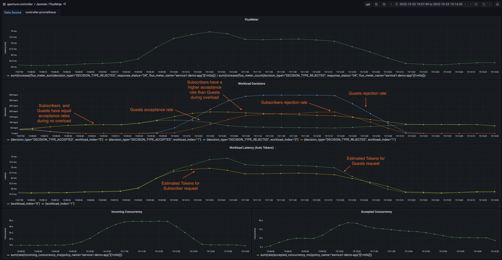

```mdx-code-block
import Tabs from '@theme/Tabs';
import TabItem from '@theme/TabItem';
import Zoom from 'react-medium-image-zoom';
```

## Policy Overview

When dealing with services in resource-limited scenarios, it becomes paramount
to prioritize key user experiences and business-critical features over less
crucial tasks or background workloads. For instance, in an e-commerce platform,
the checkout process must take precedence over functionalities like personalized
recommendations, especially during resource shortage or high traffic. Aperture's
[Weighted Fair Queuing Scheduler (WFQ)](/concepts/flow-control/components/load-scheduler.md#scheduler)
enables such prioritization of flows over others based on their labels, ensuring
user experience or revenue is maximized during overloads or other failure
scenarios.

## Policy Configuration

In this policy, users classified as subscribers will be given precedence over
guest users when connecting to
**`service1-demo-app.demoapp.svc.cluster.local`**, therefore resulting in high
priority request being served first during overload situations. The WFQ
Scheduler is set up to prioritize two types of workloads: **`guest`**, with a
priority of 50, **`subscriber`** with a priority of 100.

There are two distinct methods that are used to convey the **`user_type`**
information to the scheduler:

- Subscribers: The header value of **`user_type`** will be directly matched to
  **`subscriber`**, since all HTTP headers are directly available as flow labels
  within the scheduler.
- Guests: To identify guest users, a classification rule will be used that
  utilizes an
  [extractor](/concepts/flow-control/resources/classifier.md#extractors) to
  assign the header value to the **`user_type`** flow label key, which will then
  be used in the scheduler to match the request against the **`guest`** value to
  identify the workload.

To conclude, the prioritization of incoming requested at
**`service1-demo-app.demoapp.svc.cluster.local`** is determined by the latency
measurements of **`service3-demo-app.demoapp.svc.cluster.local`**.

:::tip

Classification rules can be written for
[HTTP requests](/concepts/flow-control/resources/classifier.md#live-previewing-requests),
and scheduler priorities can be defined for
[Flow Labels](/concepts/flow-control/flow-label.md#live-previewing-flow-labels)
by live previewing them first using introspection APIs.

:::

To improve fairness and prioritization across workloads, the scheduler will be
configured to automatically assign tokens for accepting requests that match a
given workload. This is achieved through continuous estimation of tokens (auto
tokens) performed by the scheduler itself.

```mdx-code-block
<Tabs>
<TabItem value="aperturectl values.yaml">
```

```yaml
{@include: ./assets/workload-prioritization/values.yaml}
```

```mdx-code-block
</TabItem>
</Tabs>
```

<details><summary>Generated Policy</summary>
<p>

```yaml
{@include: ./assets/workload-prioritization/policy.yaml}
```

</p>
</details>

:::info

[Circuit Diagram](./assets/workload-prioritization/graph.mmd.svg) for this
policy.

:::

### Playground

The traffic generator in the
[playground](https://github.com/fluxninja/aperture/blob/main/playground/README.md)
is configured to generate similar traffic pattern (number of concurrent users)
for 2 types of users - subscribers and guests.

Loading the policy highlighted above in the playground will reveal that, during
overload periods, requests from `subscriber` users have a higher acceptance rate
than those from `guest` users.

<Zoom>



</Zoom>

### Demo Video

The below demo video shows the basic concurrency limiter and workload
prioritization policy in action within Aperture Playground.

[](https://www.youtube.com/watch?v=m070bAvrDHM)
